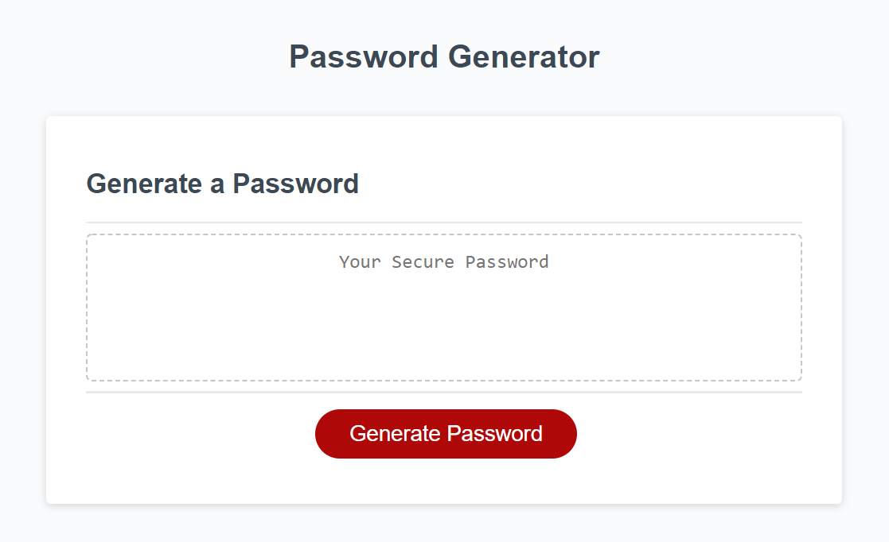

# Password-Generator

## Description 

The task that I was given was to create a functional password generator. The client wants a website that can generate a strong password for whenever they need to protect sensitive data. They request the following for their password generator.

Given a user requires a new secure password,
1. When the user click the button to generate a password, a series of prompts is presented for password criteria.
2. The user is required to enter the number of characters they wish their password to be. The number is between 8 and 128.
3. The user is asked to choose one or more of the following criteria: lowercase, uppercase, number, and/or special characters.
4. The password generated is displayed on the page.

The Password Generator website looks like:
 

In this project, I used javascript to code the password generator.

These are the specifics of the password generator:
1. Click on the button to begin
2. Enter a number between 8 and 128. If at any time you press Cancel at this point, it will cancel the password generator. If a number that is not bewteen 8 and 128 or a nonnumeric input was entered, the appropriate alert will display.
3. The next part is to choose at least one of the 4 options: lowercase, uppoercase, number and/or special characters. If none were picked, you will be asked once again until you choose at least one of the 4 options.
4. Finally a password will be generated.

Link to the Github repository: https://github.com/akwanmtl/Password-Generator

Link to the website: https://akwanmtl.github.io/Password-Generator/

## Credits

* [License badge link](https://gist.github.com/lukas-h/2a5d00690736b4c3a7ba)

## License

Copyright (c) [2020] [Annie Kwan]
